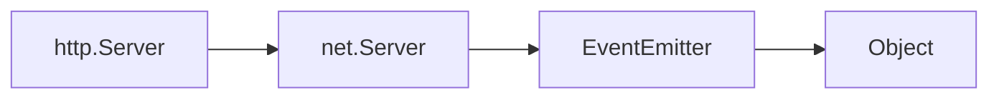

nodejs 中的 createServer 是如何实现的? 其底层返回的 web 服务器具体要具备哪些功能? 我应该如何实现一个自己的 createServer 函数? 

```javascript
import { createServer } from "node:http";

const server = createServer((req, res) => {
	res.writeHead(200, { 'Content-Type': 'text/plain' });
	res.end("hello world!\n");
});

server.listen(3000, '127.0.0.1', () => {
	console.log("Listening on 127.0.0.1:3000");
});
```

为了一探究竟, 我们从源码入手, 从上往下深挖每一个点

首先查看 createServer 函数来自于哪个文件, 通过查找我们找到了 node/lib/http.js 文件中这么定义了 createServer 函数:

```javascript

```

可以看到上述的代码仍旧只是一个简单的调用, 所以为了更深入了解 Server 具体是什么, 我们得继续追踪, 然后可以找到在 `createServer` 中 new 的 `Server` 对象定义在 _http_server.js 第 556 行. 具体定义如下:

```javascript
function Server(options, requestListener) {
	if (!(this instance of Server)) return new Server(options, requestListener);
	...
}
```

这里为什么 Server 是一个函数, 是因为早期 JS 语言的设计缺陷, 为了附和 OOP 面向对象的设计思路, 早期的 `function` 可以既作为函数来调用, 即 `function()`, 或是使用 new 关键词将其当作构造函数来调用 `new function()`. 当使用 new 关键词时, 后者会返回一个 json object. 如下

```javascript
function Person() {}

let p = new Person();

/*
p instanceof Person => true
p instanceof Object => true
typeof a => 'object'
*/

function add(a, b) { return a + b};
add(1, 2);
new add(1, 2); // valid
```

!
在使用 new 关键字调用的函数内 `this` 被绑定到对象本身, 在调用中则是全局对象, 在浏览器内是 `window` 对象.

!

对任何函数使用 new 关键字都是合法的, 所以早期 js 无法对函数的使用方式做出限制, 只能靠广大程序猿自己约束自己, 大家默认使用首字母大写的方式命名构造函数, 普通函数则使用小写字母开头, 然后根据函数名称的命名规范自己约束自己使用合适的方式. 但这个隐患很大, 所以 ES6 之后出现了两个新的概念用来解决早期 `function` 的歧义, 第一个是 **箭头函数**, 第二个是 **class 关键字**. 使用箭头函数语法声明的函数是纯函数, 无法通过 new 关键字调用, 同时没有 this 对象, this 对象为其父级作用域的 this, 在浏览器环境全局作用域内是 `window`, 在严格模式下为 `undefined`. 在某个函数内部则是该函数的 `this`.  而使用 class 声明的类, 则必须使用 new 关键字调用, 否则则会抛出错误.

!
可以从上图中看到, 当使用箭头函数语法创建函数时, 无法使用 new 来调用, 当使用 class 声明的函数时无法直接调用. 这样就从语法层面避免了函数的混用造成的问题以及函数的二义性.

!
可以看到不管是 `add` 还是 `Person` 他们的类型都还是 "function", 所以可以将 `class 关键字` 以及 `箭头函数` 视作是 js 给我们提供的 **语法糖**.

回到正题, 可以看到 nodejs 源代码中使用 new 关键字使用了 `Server` 函数, 说明该函数是视为类的构造函数使用的, 从首字母大写的命名也可以窥见.

第一行 `if (!(this instanceof Server)) return new Server(options, requestListener)` 代码的作用这里就显而易见了, 当用户将 Server 函数作为纯函数调用时, `this` 不会指向 Server 对象, 而是全局对象 `window`, 这时这行代码就会将其行为跳转到使用 new 关键字来创建对象而不是调用该函数.

继续看这个构造函数干了什么
```javascript
function Server(options, requestListener) {
	  // 设置如何传递参数, 如果只传了 handler, 则直接设置 options 为 kEmptyObject
	  // 然后验证 options 是否符合规范
	  if (typeof options === 'function') {
	    requestListener = options;
	    options = kEmptyObject;
	  } else if (options == null) {
	    options = kEmptyObject;
	  } else {
	    validateObject(options, 'options');
	  }
	  
	  // 将 options 的值保存到 Server 类的实例上, 例如 IncomingMessage 类型、ServerResponse 类型、最大头部大小、解析器安全选项、请求和头部超时、保持连接超时、是否要求 Host 头、是否合并重复头、是否拒绝非标准 body 写入等
	  storeHTTPOptions.call(this, options);
	  
	  ...
	  
	  // 这里很重要, 我们将 requestListener 函数注册为 request 事件的处理器
	  // 同时还注册了两个事件 connection 以及 listening, 并配置了默认的函数用于处理
	  if (requestListener) {
		  this.on("request", requestListener);
	  }
	  
	  this.on("connection", connectionListener);
	  this.on("listening", setupConnectionsTracking);
	  
	  ... // 其他设置代码
}
ObjectSetPrototypeOf(Server.prototype, net.Server.prototype);
ObjectSetPrototypeOf(Server, net.Server);
```

可以看到整个构造函数的核心就两个点, **第一: 设置 options 的服务器相关参数**, **第二: 注册监听器**. 同时我还在源代码该构造函数下面看到了以上末尾两行代码, 这两行代码将 Server 构造函数的原型从 `Object` 设置为了 `net.Server`, 很明显是希望继承以及使用一些 `net.Server` 类中有的函数, 那么核心就应该在那了. 同时值得注意的是, 因为 `Server` 构造函数内使用了 `on` 函数注册事件监听器, 这说明 `Server` 是一个 `EventEmitter` 的子类, 因为 `on` 函数是定义在 `EventEmitter` 上的, 而不是 js 自带的. 

ok 现在我们进到 node/lib/net.js 文件中查看 `net.Server` 的定义有何不同.

```javascript
function Server(options, connectionListener) {
	if (!(this instanceof Server)) return new Server(options, connnectionListener);
	
	EventEmitter.call(this);
	
	...
}
```

可以看到 net 中的 Server 函数内第一句也是确保该函数的执行行为应该是使用 new 关键字创建对象. 这里直接忽略. 很重要的第一个发现是, 该 Server 的第二个参数从 requestListener 变为了 connectionListener, 这说明该服务器的初始化, 要求的是传入一个 **连接监听器**, 连接监听器是在当有新客户端与服务端创建连接时触发的, 这时该监听器会收到一个 `net.Socket 实例`作为参数, 然后进行处理, 而 `http.Server` 中的 requestListener 则是当有一个 request 发送到该服务器时, 应该如何处理, 请求监听器会收到两个参数, 分别是 `http.Request 实例` 以及 `http.Response 实例`. 

第二行的 EventEmitter.call(this) 就是初始化父类, 即将 EventEmitter 上的一些属性绑定到 net.Server 实例上, 使其能够使用例如 `on` 或是 `emit` 方法, 这也是为什么 http.Server 中可以直接使用 `on` 方法, 因为末尾的两行 `setObjectPrototypeOf()` 将其设置为了 net.Server 的子类. 所以以下是当前原型链的关系图



其中 EventEmitter 提供 `on` 以及 `emit` 方法, net.Server 提供 `connectionListener` 方法, 而 http.Server 提供 `requestListener` 方法.

所以现在的问题是, net.Server 是如何处理连接的? 以及EventEmitter 是如何让各个服务器知晓何时触发事件并执行相对应的函数的呢? 我们一个一个解决, 首先第一个问题, 我们需要去找到 http.Server 中是如何初始化 connectionListener 的, 也就是当我们没有传入 connectionListener 函数时, 默认的行为在哪里.

在 _http_server.js 第 689 行定义了 connectionListener 函数
```javascript
function connectionListener(socket) {
  defaultTriggerAsyncIdScope(
    getOrSetAsyncId(socket), connectionListenerInternal, this, socket,
  );
}
```

其中该函数是直接调用了 `defaultTriggerAsyncIdScope` 函数, 我们继续深入, 我们了解到 `defaultTriggerAsyncIdScope` 以及 `getOrSetAsyncId` 函数都是 nodejs 中用于辅助管理异步资源的函数, 真正处理连接的函数仍旧是 `connectionListenerInternal`, 所以我们进到该函数里面去看看.

在文件的第 695 行, 我们可以看到该函数的定义
```javascript
function connectionListenerInternal(server, socket) {}
```

其中只看函数签名我们可以看到, 该函数接收两个参数, 分别是 `http.Server 实例` 以及 `net.Socket` 实例. 其中我们可以根据 `connectionListener` 中调用的 `getOrSetAsyncId()` 函数的第三个参数是 `this` 推断出该函数收到的是 `http.Server 实例` 而不是 `net.Server` 或是别的. 

光看函数签名看不出要做啥, 我们继续深入

```javascript
function connectionListenerInternal(server, socket) {
	debug('SERVER new http connection');
	
	// Ensure that the server property of the socket is correctly set.
	// See https://github.com/nodejs/node/issues/13435
	socket.server = server;
	
	// If the user has added a listener to the server,
	// request, or response, then it's their responsibility.
	// otherwise, destroy on timeout by default
	if (server.timeout && typeof socket.setTimeout === 'function')
	    socket.setTimeout(server.timeout);
	socket.on('timeout', socketOnTimeout);
}
```

第一行是 nodejs 提供的 debug 函数, 用于调试, 当设置 NODE_DEBUG=http 环境变量时会输出, 我们可以直接跳过.

第二行很有意思, 看起来是因为一个 bug 导致的修复, 用于给 `net.Socket` 实例正确设置 server, 对应的 issue 地址在注释内, 和我们无关我们继续深入代码

后面几行代码看注释是为 socket 连接设置 timeout, 当 socket 连接超时直接删除该 socket. 

后面几行代码开始深入核心了, 先总结一下就是:
1. 设置一个 HTTP 解析器 (parser), 用于解析客户端发送的 HTTP 请求
2. 为当前 socket 设置一堆监听器, 例如 `data`, `end`, `close`, `drain`, `error`. 用于处理例如 数据到达, 连接结束, 关闭, 流控, 错误等事件

```javascript
function connectionListenerInternal(server, socket) {
	...
	const parser = parsers.alloc();
	
	...
	const state = {
	    onData: null,
	    onEnd: null,
	    onClose: null,
	    onDrain: null,
	    outgoing: [],
	    incoming: [],
	    // `outgoingData` is an approximate amount of bytes queued through all
	    // inactive responses. If more data than the high watermark is queued - we
	    // need to pause TCP socket/HTTP parser, and wait until the data will be
	    // sent to the client.
	    outgoingData: 0,
	    requestsCount: 0,
	    keepAliveTimeoutSet: false,
	};
	state.onData = socketOnData.bind(undefined,
								   server, socket, parser, state);
	state.onEnd = socketOnEnd.bind(undefined,
								 server, socket, parser, state);
	state.onClose = socketOnClose.bind(undefined,
									 socket, state);
	state.onDrain = socketOnDrain.bind(undefined,
									 socket, state);
	socket.on('data', state.onData);
	socket.on('error', socketOnError);
	socket.on('end', state.onEnd);
	socket.on('close', state.onClose);
	socket.on('drain', state.onDrain);
}
```

可以看到具体核心逻辑应该在 `parser` 以及 `socketOnData` 函数中. js 中的 `bind` 函数会返回一个新函数, 其中新函数的 this 会被绑定为 bind 的第一个参数, 后续参数会被绑定为新函数的参数.

所以这里 `state.onData` 也是一个函数, 里面应该包含了使用 parser 等来封装 HTTP 请求的逻辑.

以下是 `socketOnData` 函数的逻辑, 在文件的第 861 行

```javascript
function socketOnData(server, socket, parser, state, d) {
  ...
  const ret = parser.execute(d);
  onParserExecuteCommon(server, socket, parser, state, ret, d);
}
```

代码很短, 可以看到核心就是调用 `parser.execute` 来处理 HTTP 请求, 以及 `onParserExecuteCommon` 来响应? 

写道这里我在疑惑, 那么是谁负责 `emit` "connection" 信号给服务器, 并将 socket 传递给 ta, 让其接管进行处理的? 现在看到的大部分代码都是负责接收事件, 那么核心应该就在于发事件的那个人是如何做的. 这个也是我们实现服务器的核心.

所以接下来我想深入去寻找一下**事件发出者**.

通过 AI 的帮助, 我了解到事件 connection, data, request 等都是由 `net` 模块中的 `net.Server` 发出的, 即 `http.Server` 的父类. 在代码中寻找, 我们可以在 net.js 中的 onconnection 函数中找到如下这段代码:

```javascript
function onconnection(err, clientHandle) {
	const handle = this;
	const self = handle[owner_symbol];
	...
	const socket = new Socket(...);
	self.emit("connection", socket);
}
```

也就是 `onconnection` 函数调用时会发出该信号, 并将新创建的 `net.Socket` 实例作为参数传递给注册 connection 事件的监听器. 

那么 `onconnection` 何时会被调用呢? 我们可以看到 onconnection 函数被注册到了 handle 上, 所以 handle 会负责调用该函数, 而 handle 本身辗转腾挪最后发现是在创建 net.Socket 对象时传入的 handle 值
```javascript
function onconnection(err, clientHandle) {
	...
	const socket = new Socket({
		handle: clientHandle,
		...
	});
}
```

而 clientHandle 是在该函数被调用时传入的, 很奇怪, 就像循环引用一样. 

不过我们还有个思路就是从下往上去发掘, 现在已经认识到了 nodejs 底层是基于 libuv 库的, libuv 会负责和用户请求, socket 等接轨, 所以我们可以从 libuv 动手深入. 今天先这样子, 明天继续. 

--- 丑陋的分割线 ---

昨天跟踪着 nodejs 的源码, 从 `createServer` 开始陆续找到了三个核心模块, 其中 `http.Server` 负责注册 `requestListener`, `net.Server` 负责注册 `connectionListener`, `EventEmitter` 则提供了最基础的监听事件 (`on`) 与发送事件(`emit`) 的功能. 

同时还了解到 nodejs 底层是基于 libuv 库来构建的事件循环, libuv 是一个 c++, 利用原生 epoll, poll 和 select 实现的事件循环机制库. 而 nodejs 中最基本的 "connection", "data" 等事件, 实际触发者是使用 C 编写的 TCPWrap 对象. 中间通过 js 和 C 胶水代码来缝合.

整个 nodejs 的核心构建于两个 **东西** 之上, 分别是 **V8 Engine** 以及 **Event Loop (libuv)**. V8 引擎可以理解为 JVM 虚拟机, 能够跨平台运行 js 代码, 而 Event Loop 则提供对 js 中异步操作的支持. 

待完成...